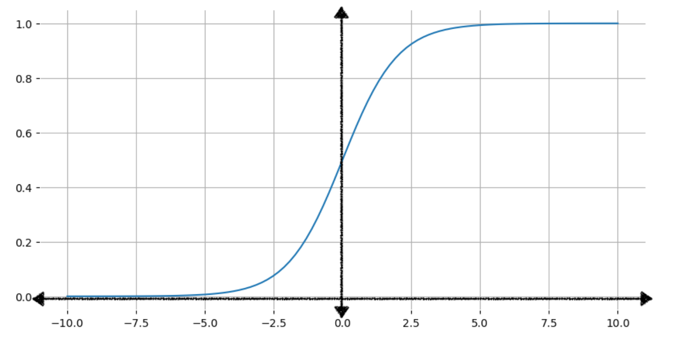

# Logistic Regression: Calculating a Probability with the Sigmoid Function

> Source: [Google ML Crash Course – Sigmoid Function](https://developers.google.com/machine-learning/crash-course/logistic-regression/sigmoid-function)

## The Core Problem

Linear regression outputs any number (e.g. MPG, price — unbounded). But sometimes what you want is a **probability** — a value that must always be between 0 and 1 (e.g. "93.2% chance this email is spam").

Logistic regression solves this by taking a normal linear equation and squashing its output into the 0–1 range using the **sigmoid function**.

Two ways to use the output:
- **As-is** → a probability (e.g. `0.932` = 93.2% chance of spam).
- **Converted to a binary category** → `True`/`False`, `Spam`/`Not Spam` (covered later, in Classification module).

## The Sigmoid Function
f(x) = 1 / (1 + e^-x)
- `e` = Euler's number (~2.71828).
- Shape: an "S" curve. As `x → +∞`, output approaches (but never touches) `1`. As `x → -∞`, output approaches (but never touches) `0`.
- At `x = 0`, output is exactly `0.5`.

| Input (x) | Sigmoid output |
|---|---|
| -7 | 0.001 |
| -3 | 0.047 |
| -1 | 0.269 |
| 0 | 0.50 |
| 1 | 0.731 |
| 3 | 0.952 |
| 7 | 0.999 |

**Key property**: no matter how extreme the input, the output is always strictly between 0 and 1 — never exactly 0 or exactly 1.

## Two-Step Process: Linear → Sigmoid

**Step 1 — Linear part (same as linear regression):**
z = b + w1x1 + w2x2 + ... + wN*xN
This `z` is called the **log-odds**. It's just the familiar weighted-sum-plus-bias — but it can be *any* number (huge, tiny, negative).

**Step 2 — Squash it through sigmoid:**
y' = 1 / (1 + e^-z)
Now `y'` is guaranteed to be between 0 and 1 — a valid probability.

**Why "log-odds"?** If you algebraically solve the sigmoid equation for `z`, you get:
z = ln( y / (1 - y) )
This is the natural log of the ratio between "probability it happens" and "probability it doesn't." That ratio is called **odds** in statistics — hence *log-odds*.

## Worked Example

Given: `b=1, w1=2, w2=-1, w3=5`
Input: `x1=0, x2=10, x3=2`

**Step 1 — compute z:**
z = 1 + (2)(0) - (10) + (5)(2)
z = 1 + 0 - 10 + 10
z = 1
**Step 2 — pass z through sigmoid:**
y' = 1 / (1 + e^-1) = 1 / (1 + 0.367) = 1 / 1.367 ≈ 0.731
Result: **73.1% probability**.

## My Takeaways
- [ ] Logistic regression = linear regression's weighted sum (`z`), then squashed through sigmoid into a probability.
- [ ] `z` (log-odds) can be any real number — sigmoid is what constrains the final output to (0, 1).
- [ ] Sigmoid output is *never* exactly 0 or 1, only ever asymptotically close.
- [ ] This is a two-step calculation: compute `z` like before → plug `z` into `1/(1+e^-z)`.
- [ ] "Log-odds" name comes from the fact that solving sigmoid for `z` gives `z = ln(y/(1-y))`.
